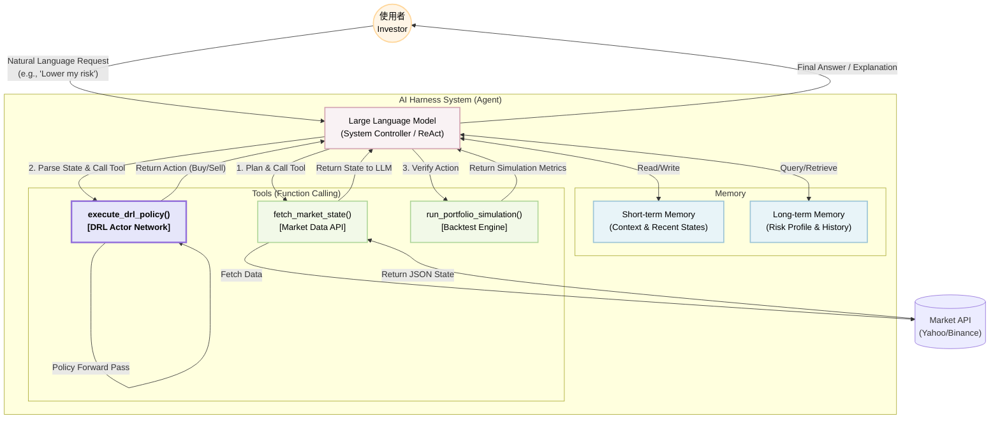
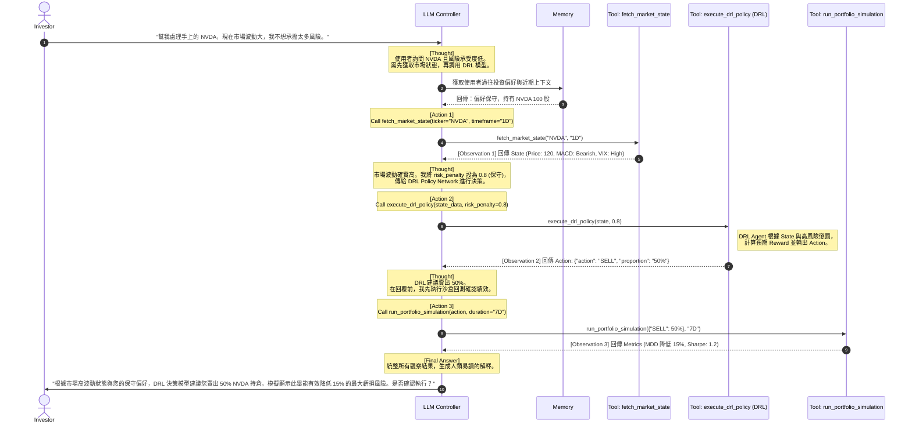

# Homework 4 — 資訊圖表 (Infographics)
**主題：智能量化交易決策代理 (DRL-based Algorithmic Trading Agent)**

以下圖表使用 Mermaid 語法繪製，展示了 AI Harness 系統架構與 Agent 的工作流程 (ReAct Workflow)。

## 1. System Architecture Diagram (AI 系統架構圖)

此架構圖展示了 LLM 如何作為核心控制器 (System Controller)，連接短期/長期記憶 (Memory)，並透過 Tool Chain 呼叫外部的 API 以及核心的 **DRL Policy Network**。

---

## 2. Agent Workflow (Sequence Diagram - 時序圖)

此時序圖詳細呈現了使用者輸入指令後，系統內部的多步驟任務執行流程 (ReAct 模式)。特別著重於 LLM 如何與 DRL 模型互動。

